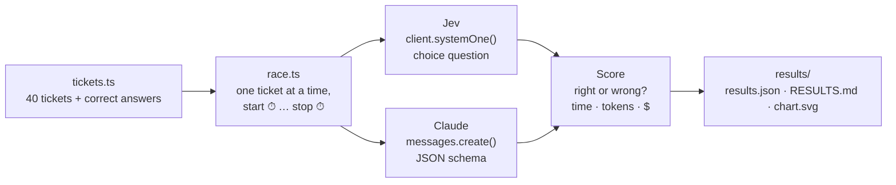

# 🏁 Jev Speed Race

**Jev vs. a frontier LLM on the same job: routing 40 customer-support tickets.**

[Jev](https://typesafe.ai) is a new kind of AI model from TypeSafe AI. It doesn't write text.
You ask it a typed question, for example *"which of these 4 teams should get this ticket?"*,
and it returns one of your labels with a probability for each.
This project measures how much faster and cheaper that is than asking a chat model.

> 📊 **Results:** see [`results/RESULTS.md`](results/RESULTS.md) after running the race.
> A preview built with simulated data is in [`results/demo/`](results/demo/RESULTS.md).

## How it works



Both racers get **the same tickets, the same 4 categories, and the same descriptions**.
The only difference is the model that answers.

| | Jev | Claude |
|---|---|---|
| How we ask | `choice("Which team…?", {billing, technical, shipping, account})` | System prompt + JSON schema with an `enum` of the 4 teams |
| What comes back | `{ choice: "billing", confidence: 0.97, probabilities: {…} }` | `{"team": "billing"}` |
| Price (per 1M tokens) | $0.042 input, output free | $4 input, $20 output (Opus 5.5) |

## Run it yourself

You need Node.js 20 or newer.

```bash
npm install

# 1. Try it with fake racers (no API keys needed)
npm run race:demo

# 2. Run the real race
cp .env.example .env     # then paste your two API keys into .env
npm run race
```

You'll see each lap live (✅ right, ❌ wrong, 💥 error), then a summary table.

To race a different Claude model, set `CLAUDE_MODEL` (and update its price in `src/racers.ts`).

## Project layout

```
src/
  tickets.ts   the race course: 40 tickets with the right answers
  racers.ts    Jev, Claude and demo racers, all with the same shape
  race.ts      runs the race, scores it, saves results
  chart.ts     draws results/chart.svg
results/       output from the real race
results/demo/  output from the demo race (simulated)
```

## Fairness notes

- Calls run **one at a time** so we measure latency, not throughput.
- Each racer gets **one warm-up call** that isn't timed, so connection setup doesn't count.
- Claude runs at `effort: "low"`, its fastest setting, because this is a simple task.
- Some tickets are tricky on purpose (e.g. *"The payment page shows a blank white screen"* is
  **technical**, not billing).
